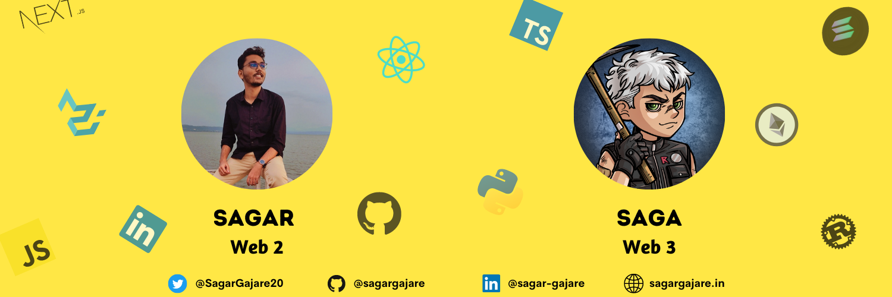

  

Hey there 👋

I’m Sagar,

- 🔭 I’m currently doing **freelancing**

- 🌱 I’m currently learning **Solana Blockchain**

- 💬 Ask me about **Reactjs, Nextjs, MERN Stack, Django, Flask, Webscraping, and Website Development**

- 📫 How to reach me **sggajare360@gmail.com**

- 👨‍💻 Visit my personal website [**sagargajare.in**](http://sagargajare.in/ "Portfolio")

 

 
  
## Projects and OpenSource Contributions
  
  
|  Name  | Description   | Source Code    |   Deployed at |   Pull Request  | Star |
|--- |--- |--- |--- |---  |--- |
   |  RayAuth |  Gasless transactions, signing transactions with the RayAuth wallet and session keys   | [Repo](https://github.com/AnishDe12020/rayauth)   | [Website](https://www.rayauth.com/)  |   |    |
|  Rentii NFT |  NFT Rental Platform on Solana Blockchain   | | [Website](http://rentii.xyz/)  |   |   |
|  Flaq CMS |  Content Management System built on Notion and Nextjs   | [Repo](https://github.com/AffableSarthak/flaq-learn-cms/)   | [Website](http://learn.flaq.club/)  |   |    |
| Clipboard History Chrome Extension   |  An extension to save history of copied text in Chrome browser  | [Repo](https://github.com/saifabusaleh/clipboard-history-extension)   |  [ChromeStore](https://chrome.google.com/webstore/detail/clipboard-history/mhokbaagmjlbflncohdhinppihlojpco?hl=en&authuser=0)  | [PR](https://github.com/saifabusaleh/clipboard-history-extension/pull/20)   |   |
|  Anchor Test UI |  Web Application which allows you to enter your anchor program's IDL and the application create's a GUI for interacting with it.   | [Repo](https://github.com/0xPratik/anchor-ui)   | [Website](http://anchor-ui.vercel.app/)  | Hard Pushed(Check README)  |    |
|  Superteam Reputation |  Reputation Dashboard for Superteam DAO  | [Repo](https://github.com/SuperteamDAO/superteam-reputation)   | [Website](https://reputation.superteam.fun/)  | [PR1](https://github.com/SuperteamDAO/superteam-reputation/pull/30) [PR2](https://github.com/SuperteamDAO/superteam-reputation/pull/24) [PR3](https://github.com/SuperteamDAO/superteam-reputation/pull/23) |    |

 
  

## &#x1f4c8; GitHub Stats

 

  &emsp;   
 
     

